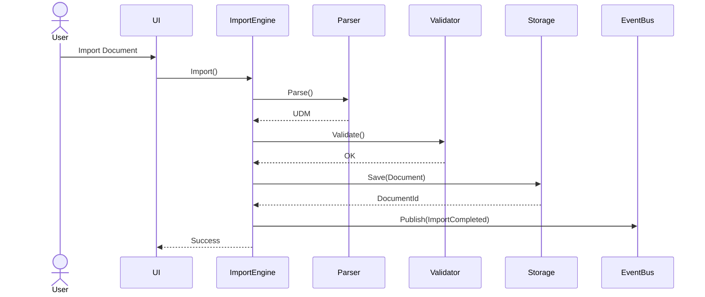
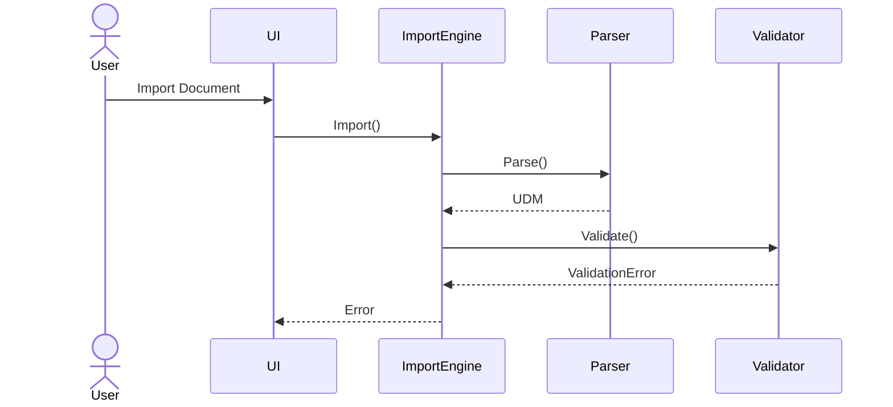

# Sequence Diagrams

## SD-001 - Importación exitosa

```mermaid
sequenceDiagram

actor User

participant UI
participant ImportEngine
participant Parser
participant Validator
participant Storage
participant EventBus

User->>UI: Import Document

UI->>ImportEngine: Import()

ImportEngine->>Parser: Parse()

Parser-->>ImportEngine: UDM

ImportEngine->>Validator: Validate()

Validator-->>ImportEngine: OK

ImportEngine->>Storage: Save(Document)

Storage-->>ImportEngine: DocumentId

ImportEngine->>EventBus: Publish(ImportCompleted)

ImportEngine-->>UI: Success
```

---

## SD-002 - Error de validación

```mermaid
sequenceDiagram

actor User

participant UI
participant ImportEngine
participant Parser
participant Validator

User->>UI: Import Document

UI->>ImportEngine: Import()

ImportEngine->>Parser: Parse()

Parser-->>ImportEngine: UDM

ImportEngine->>Validator: Validate()

Validator-->>ImportEngine: ValidationError

ImportEngine-->>UI: Error
```
